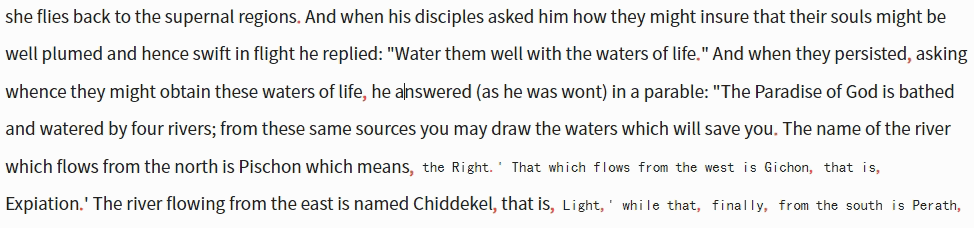
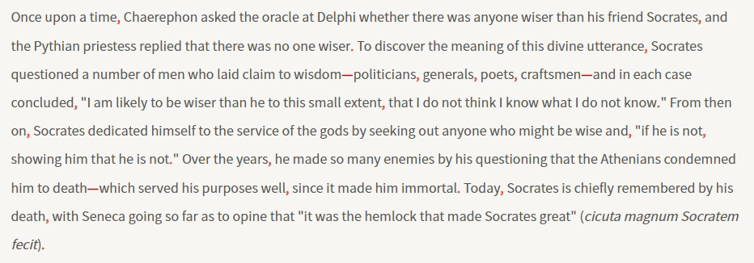
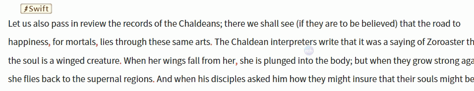

# SwiftMatch

An Obsidian plugin for quick text search and highlight across your vault. / 一个 Obsidian 快速搜索高亮插件。

## Features / 功能

- **Swift Seek / 即划即搜** — Select text, instantly highlight all matches on the current page with a live counter / 选中文本，当前页面即时显示所有匹配并计数

  

- **Pin Tally / 固定计数** — Pin keywords to track match counts across multiple terms at a glance / 固定关键词，同时查看多个关键词的匹配次数

  

- **Vault Scan / 搜索全库** — Background search across your entire vault the moment you select text; floating toggle shows matched document count / total matches / 使用 Obsidian 搜索 API，选中文字即后台搜索，悬浮按钮显示匹配文档数/总匹配数量

  

- **Keyword Fleet / 多组关键词悬浮** — Float multiple keyword groups independently on screen, each with its own counter / 搜索关键词可单独悬浮显示，支持同时悬浮多组关键词

  

## Installation / 安装

Search for "SwiftMatch" in Obsidian Settings → Community Plugins → Browse, then click Install and Enable. / 在 Obsidian 设置 → 社区插件 → 浏览中搜索"SwiftMatch"，点击安装并启用即可。

## Changelog / 更新日志

Changelog / 更新日志

v1.4.1 (2026-06-18)

- **Counter Style Presets / 计数样式预设** — Added 6 counter badge style presets (Glassmorphism, Gradient Capsule, Outlined, Ribbon, Dot Indicator) selectable in settings / 新增6种计数badge样式预设（毛玻璃、渐变胶囊、描边气泡、丝带旗帜、圆点指示器），设置面板可选
- **Counter line-height Fix / 计数行高修复** — Added `line-height:1` to counter `::after` pseudo-elements, fixing vertical padding that couldn't be reduced below a minimum / 计数器`::after`伪元素添加`line-height:1`，修复垂直内边距无法继续缩小的问题
- **Settings Section Shading / 设置面板底纹** — Collapsible section titles now have background shading for better visual separation / 可折叠标题部分添加底纹，增强视觉分隔
- **Multi-Keyword Search / 多关键词搜索** — Pipe-separated keywords (e.g. `鸽子|导航|磁场`) search across vault; results sorted by keyword match count; each keyword highlighted in a different color / 竖线分隔多关键词全库搜索，按匹配关键词数排序，每个关键词不同颜色高亮
- **Require All Keywords / 仅显示包含所有关键词的文档** — New option (default on) to only show documents containing all search keywords / 新增选项（默认开启），仅显示包含所有搜索关键词的文档
- **Search Loading Indicator / 搜索加载提示** — All search modes now show a "Building..." indicator while searching / 所有搜索模式搜索时显示"正在构建..."提示
- **Search on Input Toggle / 输入即搜选项** — New option (default off) to require Enter key to trigger search instead of typing / 新增选项（默认关闭），需按Enter才触发搜索而非输入即搜
- **Background Search on Selection / 选中文字后台搜索** — Selecting text no longer auto-shows the match window; search runs in background and badge updates; click floating toggle to view results / 选中文本不再自动弹出匹配窗口，搜索在后台进行并更新badge；点击悬浮按钮查看结果
- **Minimap Blacklist for Plugin Pages / minimap黑名单支持插件页面** — Blacklist now matches view titles (e.g. "Thino") and view types for plugin pages without file paths; case-insensitive matching / 黑名单支持通过视图标题（如"Thino"）和视图类型匹配无文件路径的插件页面；大小写不敏感匹配

v1.4.0 (2026-06-17)

- **Selection Match Window Fix / 选中关键词匹配窗口修复** — Fixed bug where hovering the floating toggle after selecting new text would show the previous keyword instead of the current selection; now correctly prioritizes the active search term over the last-displayed term / 修复选中新关键词后悬停悬浮按钮仍显示旧关键词的问题；现在正确优先使用当前搜索词而非上次显示的词
- **Pinned List State Sync / 固定列表状态同步** — `_pendingShowList` now updates even when the list is pinned or in exhaustive mode, preventing stale display after keyword switch / 列表固定或全库搜索模式下切换关键词时也同步更新 `_pendingShowList`，避免显示过期内容

v1.3.9 (2026-06-17)

- **Keyword Switching Fix / 关键词切换修复** — Fixed race condition where switching keywords via recent search chips would jump back to the previous keyword; added generation-based search cancellation to fully discard stale async results / 修复点击最近搜索关键词后跳回上一个关键词的竞态问题；用搜索代次机制彻底废弃旧异步搜索结果
- **Immediate Switch for Uncached Keywords / 无缓存关键词立即切换** — Clicking a keyword without cache now immediately shows a searching state and starts incremental result rendering / 点击无缓存关键词时立即显示搜索中状态并增量渲染结果
- **Disk Cache Loading on Restart / 重启后加载磁盘缓存** — Chip clicks and showMatchList now load cached results from disk when memory cache is empty after restart / 重启后内存缓存为空时，chip点击和showMatchList会从磁盘加载缓存
- **Cancel Search on Switch / 切换时取消搜索** — Switching keywords or hitting cache now immediately cancels any in-progress background search / 切换关键词或命中缓存时立即取消后台搜索
- **No Reorder on Chip Click / 点击不移动位置** — Clicking a recent search keyword no longer moves it to the top of the list; new keywords are still added normally / 点击最近搜索关键词不再将其移到列表开头；新词仍正常添加
- **Scroll Position Cleanup / 滚动位置清理** — Deleting a search keyword now also removes its saved scroll position; persistence and loading filter out stale entries / 删除搜索词时同步清理保存的滚动位置；持久化和加载时过滤无效条目
- **Remove Console Logs / 移除控制台日志** — Removed all console.log/time/timeEnd calls; kept console.error for error reporting / 移除所有console.log/time/timeEnd调用，保留console.error
- **Expandable Match Entries / 可展开匹配条目** — Each document now shows match count in header; default shows 3 entries with expand/collapse toggle; snippet limit raised from 3 to 30 / 文档标题显示匹配数量，默认折叠显示3条可展开，snippets上限从3提升到30

v1.3.8 (2026-06-17)

- **Multi-Style Support / 多组样式支持** — Floating edit panel now supports multiple custom CSS styles with auto-parsed class previews; click to select default style / 编辑悬浮球窗口支持多组自定义CSS样式，自动解析class并预览，点击选择默认样式
- **Style Persistence / 样式数据持久化** — Custom styles saved to data.json, preserving user styles across plugin updates / 自定义样式保存到data.json，插件更新时不覆盖用户样式
- **Style Stacking Fix / 修复样式叠加** — Fixed bug where applying a new style would stack with the previous one / 修复应用新样式时与旧样式叠加的bug
- **Compact Settings Layout / 设置面板紧凑布局** — "Basic", "Counter Style", and "Pin Icon" sections reorganized to horizontal compact layout / "基础"、"计数样式"、"固定图标"部分改为横向紧凑布局
- **Live Style Preview / 实时样式预览** — Floating button in settings panel now displays actual current style as clickable text / 设置面板中的悬浮按钮改为可点击文字，实时显示当前样式

v1.3.7 (2026-06-16)

- **Settings Panel Restructure / 设置面板重组** — Moved "Show/Hide Floating Button" under "Floating Button Style" heading; renamed "Floating Toggle Style" to "Floating Button Style"; added "minimap" section title in Basic tab / "显示/隐藏悬浮按钮"移至"悬浮按钮样式"标题下方；"悬浮球样式"改名为"悬浮按钮样式"；基础tab下新增"minimap"分组标题
- **Minimap Blacklist / minimap 黑名单** — New blacklist setting under minimap section to hide minimap on specific pages (supports * wildcard); default rule `*.canvas` hides minimap on canvas pages; supports path matching for non-markdown views / minimap 分类下新增黑名单设置，支持通配符匹配路径屏蔽页面；默认规则 `*.canvas` 屏蔽画布页面；支持非 markdown 视图的路径匹配
- **Pin Icon Fix / 固定按钮修复** — Pin icon now appears only once after text selection; no longer re-creates on repeated events / 选中文字后固定按钮只显示一次，不再因重复事件重复创建

v1.3.6 (2026-06-16)

- **Cache Limit Increased / 缓存上限提升** — Recent search cache limit raised from 10 to 20 / 最近搜索缓存上限从10提升到20
- **Middle-Click Cache Cleanup / 中键删除缓存文件** — Middle-clicking to delete a recent search now also removes its disk cache file / 中键删除最近搜索词时一并删除磁盘缓存文件
- **Empty State Match Window / 空状态匹配窗口** — Hovering the floating toggle with no selection, cache, or recent searches now shows the match window with search box / 无选中文字、无缓存、无最近搜索时，悬浮按钮hover也弹出匹配窗口
- **Search Box in Header / 搜索框移入标题栏** — Moved search input into the header bar alongside match info to save vertical space / 搜索框移至匹配信息header中，压缩纵向空间
- **Close Clears Search Box / 关闭清除搜索框** — Closing the match window now clears the search input / 关闭匹配窗口时清空搜索框文字
- **Search Term Highlight / 搜索词高亮** — Matched keywords are highlighted with orange background in the match list results / 匹配列表结果中高亮显示搜索关键词
- **Favorites Feature / 收藏功能** — Star button on recent search chips to add/remove favorites; favorites section with persistent cache; middle-click to delete; scroll position saved / 最近搜索词前添加五角星按钮，点击收藏/取消；收藏区独立显示，缓存不清除；中键删除；滚动位置保存
- **Compact Layout / 紧凑布局** — Favorites and recent searches labels now inline with chips on the same row / 收藏和最近搜索标签与关键词同一行显示
- **Expand All at Once / 一键展开全文** — Clicking the "+" expand button now reveals the full line instead of incrementing by 30 chars; expanded state is preserved across reopens / 点击"+"按钮直接展开整行内容，展开状态跨次保留
- **Selected Text Open Document / 选中文字打开文档** — When text is selected in the match list, clicking "Open Document" highlights the selected text instead of the auto-detected text / 匹配窗口选中文字后点击"打开文档"，高亮选中文字而非自动检测文字

v1.3.5 (2026-06-16)

- **Open Document Jump Fix / 打开文档跳转修复** — Full-text search instead of per-line search; suppress Remember Cursor Position plugin restore; scroll to vertical center / 全文搜索替代逐行搜索；抑制 Remember Cursor Position 插件恢复光标；滚动到垂直居中
- **Marshmallow Highlight / 棉花糖高亮样式** — Jump text highlighted with custom marshmallow style after opening document; click anywhere in editor to dismiss / 打开文档后用自定义棉花糖样式高亮跳转文本；点击编辑器任意位置移除高亮
- **Snippet Expand Buttons / 摘要扩展按钮** — Replaced "..." truncation markers with "+" buttons; click to incrementally expand context before/after / 截断的"..."替换为"+"按钮，点击逐步扩展前后上下文
- **Title Click Opens Document / 标题点击打开文档** — Clicking match list title now opens document in new tab; removed preview panel trigger / 点击匹配窗口标题直接新标签页打开文档；移除预览窗口触发
- **Search Box in Match List / 搜索框移至匹配窗口** — Moved search input from floating toggle to match list header; auto-focus on open; instant search on input with debounce / 搜索输入框从悬浮按钮移到匹配窗口顶部；自动聚焦；输入即时搜索（防抖）
- **Independent Cache Storage / 缓存独立存储** — Search caches and floating keyword data moved from list-data.json to separate cache/ and keywords/ directories / 搜索缓存和悬浮关键词数据从 list-data.json 移到 cache/ 和 keywords/ 子目录
- **Document Count Fix / 文档数量修复** — Exhaustive search now correctly updates document count and total matches in header after completion / 全库搜索完成后正确更新标题中的文档数和结果总数
- **Middle-Click Delete Search / 中键删除搜索** — Middle-click on recent search chip removes it from history / 最近搜索关键词中键点击删除
- **CSS Lint Fixes / CSS 规范修复** — Removed box-decoration-break and all !important declarations / 移除 box-decoration-break 和所有 !important 声明
- **Placeholder Language Switch / 搜索框语言切换** — Search box placeholder updates immediately on language change / 搜索框占位符随语言即时更新

v1.3.4 (2026-06-15)

- **Edit Panel Horizontal Layout / 编辑面板横向排列** — Rearranged display text, font size, padding, and opacity fields into a flex row; added "Get more styles" link to GitHub Discussions / 显示文字、字体大小、内边距、透明度改为横向布局；自定义样式标题后添加"获取更多样式"链接
- **Follow Mouse Offset / 跟随鼠标偏移设置** — Added pinIconFollowOffsetX/Y settings with live preview box; only visible in follow-mouse mode / 新增 pinIconFollowOffsetX/Y 偏移设置，含实时预览框；仅跟随鼠标模式显示
- **Rounded Cap Highlight / 圆帽高亮样式** — Replaced underline with radial-gradient rounded cap decoration; removed border width setting; added match opacity slider / 下划线改为圆帽底部装饰；移除下划线宽度设置；新增匹配透明度滑块
- **Floating Toggle Settings Rework / 悬浮球设置面板改造** — Removed display text input; toggle button now shows/hides with capsule styling; no longer closes settings panel / 移除显示文字输入框；按钮改为胶囊样式切换显示/隐藏，不再关闭设置面板
- **Pin Border Residue Fix / 固定边框残留修复** — Cleared boxShadow on unpinned items with custom styles to prevent inset border residue / 非固定且有自定义样式时清除 boxShadow，避免边框残留
- **Pin Color Overlap Fix / 固定颜色叠加修复** — Skipped current selection decoration when already pinned to avoid double color overlay / 当前选中文本已固定时跳过装饰，避免双层颜色叠加
- **Pin Highlight Missing Fix / 固定高亮不显示修复** — Set filePath on new pinned items; added fallback for legacy items without filePath / 为新固定项设置 filePath；兼容无 filePath 的旧数据

v1.3.3 (2026-06-15)

- **Floating Toggle Context Menu / 悬浮球右键菜单** — Right-click the floating toggle to show options: Edit, Hide, Settings / 右键点击悬浮球弹出选项：编辑、隐藏、设置
- **Floating Toggle Edit Panel / 悬浮球编辑面板** — Edit display text, font size, padding, opacity, CSS class name, and custom CSS with live preview; custom styles override default inline styles for full appearance control / 可编辑显示文字、字体大小、内边距、透明度、CSS类名和自定义CSS，支持实时预览；自定义样式时移除默认内联样式，完全控制外观
- **Keyword Button Context Menu / 搜索词按钮右键菜单** — Right-click keyword buttons to show options: Edit, Close / 右键点击搜索词按钮弹出选项：编辑、关闭
- **Keyword Button Edit Panel / 搜索词按钮编辑面板** — Edit display text, CSS class name, and custom CSS with live preview; styles are persisted per keyword / 可编辑显示文字、CSS类名和自定义CSS，支持实时预览；样式按关键词持久化保存
- **Language Switch Fix / 语言切换修复** — Fixed null.style error when switching language in settings panel; language switch now reopens the panel instead of reloading the plugin / 修复设置面板切换语言时的 null.style 错误；语言切换改为重新打开面板而非重载插件
- **Language Button Style / 语言按钮样式** — Changed from button to clickable text; removed border, padding, and background / 从按钮改为可点击文本；移除边框、内边距和背景
- **Follow Mouse Mode Fix / 跟随鼠标模式修复** — Fixed pin icon constantly following the cursor making it unclickable; now shows at cursor position once and stays fixed / 修复固定图标一直跟随鼠标导致无法点击的问题；现在只在光标位置显示一次然后固定
- **Z-Index Fix / Z-Index修复** — Hovered floating button now raises z-index to cover other buttons, preventing accidental clicks / 悬浮按钮hover时提升z-index盖住其他按钮，避免误触
- **Title Cleanup / 标题清理** — Removed (helloworld) from settings panel title / 移除设置面板标题中的(helloworld)

v1.3.0 (2026-06-13)

- **i18n Support / 国际化支持** — Added CN/EN language switch button in settings panel header; all UI text fully internationalized / 设置面板标题栏添加中英文切换按钮；所有 UI 文本完整国际化
- **Local Pinned Mode / 固定计数局部模式** — Pinned keyword counters now only display in their source document instead of globally / 固定关键词计数仅在来源文档中显示，不再全局显示
- **Open Document Highlight / 打开文档高亮** — Clicking "Open Document" now selects and highlights the search text with custom style; added delay to avoid conflict with "Remember Cursor Position" plugin / 点击"打开文档"后选中文本并以自定义样式高亮；增加延迟避免与"Remember Cursor Position"插件冲突
- **File Name Matching / 文件名匹配** — Search now matches file names including extension (e.g. searching "论人的尊严" finds "论人的尊严.md") / 搜索时匹配文件名（含后缀），如搜索"论人的尊严"可找到"论人的尊严.md"
- **Persistent Recent Searches / 持久化最近搜索** — Recent search results are saved to disk and restored after restart / 最近搜索结果保存到磁盘，重启后恢复
- **Per-Keyword Scroll Position / 按关键词保存滚动位置** — Each search keyword's result list scroll position is saved and restored independently / 每个搜索关键词的结果列表滚动位置独立保存和恢复
- **Search Window Improvements / 搜索窗口改进** — Right-side 10px padding; full file path display (with directory and extension); default cursor instead of grab cursor / 右侧 10px 边距；显示完整文件路径（含目录和后缀）；默认光标替代抓取光标
- **UI Cleanup / UI 清理** — Removed delete button and keyword tag from match entries; removed "Rebuild Heading Cache" and "About" from settings footer / 移除匹配条目的删除按钮和关键词标签；移除设置面板底部的"重建标题缓存"和"关于"
- **Drag Window Height Compression / 拖动窗口高度压缩** — Dragging keyword buttons below window height now compresses the list instead of jumping to top / 拖动关键词按钮低于窗口高度时压缩列表高度，而非跳到顶部
- **Hover Behavior Fix / 悬停行为修复** — Hovering keyword floating buttons no longer changes the main toggle button state / 悬浮关键词按钮悬停时不再改变主按钮状态

v1.2.4

- Added "Selection Match List" toggle in settings to enable/disable the match list popup on text selection / 新增"划词匹配列表"设置开关，可以启用或禁用划词时弹出匹配列表的功能

v1.2.3

- Fixed preview panel not closing when middle-clicking a list entry to open a document in a new tab / 修复了中键点击列表条目在新标签页打开文档时，预览弹窗无法关闭的问题

